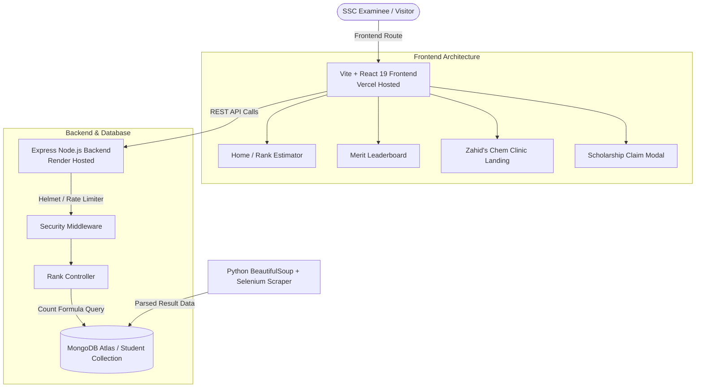

# 🏆 CTG Board Rank Checker & Zahid's Chem Clinic Platform

[](https://github.com/aliazgorLab/ctgboardrank)
[](https://react.dev/)
[](https://www.typescriptlang.org/)
[](https://nodejs.org/)
[](https://www.mongodb.com/atlas)
[](https://tailwindcss.com/)
[](LICENSE)

An enterprise-grade high-performance web platform for **SSC Examinees in Chittagong Education Board** to calculate exact board merit ranks, explore top merit leaderboards, and claim exclusive scholarships for **Zahid's Chem Clinic HSC '28 Chemistry Offline Course**.

---

## 📌 Key Highlights & Features

### 1. 🎯 Exact Board Merit Position Calculator ($O(\log N)$)
- **Atomic MongoDB Querying**: Utilizes index-covered `countDocuments` queries to compute board-wide rank positions in under **10ms**, bypassing memory overhead even under result-day traffic spikes ($140,000+$ students).
- **Tie-Breaker Hierarchy**: Strictly enforces official board rules:
  1. **GPA Score** (Descending)
  2. **Total Marks** (Descending)
  3. **Core Subject Marks** (Descending — Physics, Chemistry, Higher Math, Biology / General Math & Science)

### 2. 📊 Chittagong Board Top Merit Leaderboard (`/leaderboard`)
- **Interactive 7-Column Table**: Renders `Rank`, `Name`, `Roll`, `GPA`, `Group`, `Total Marks`, and `Institution`.
- **Group Filter Dropdown**: Instant filtering across **Science**, **Humanities**, and **Business Studies**.
- **Paginated API**: Supports fast server-side pagination (`?page=1&limit=100`).
- **Official Disclaimer**: Displays independent data compliance disclaimers above the leaderboard.

### 3. 🎓 Zahid's Chem Clinic Marketing Landing Page (`/zahid-chem-clinic`)
- Dedicated promotion hub for **HSC '28 Chemistry 1st Paper Offline Course** taught by **Zahid Sir**.
- Complete details on classroom environment, concept-first pedagogy, offline location (**Gulzar Tower, 4th Floor, Chawkbazar, Chattogram**), and hotline (`01841783983`).

### 4. 🎟️ Personalised Scholarship Voucher & Card Generator
- **Lead Conversion Flow**: Form modal collects student name, SSC roll, school, and contact number.
- **Card Generation**: Issues a branded dark-gold certificate with a **25%+ Scholarship Discount** and unique verification voucher code (e.g., `ZCC-SCH-109842-4921`).
- **Dual Export Options**:
  - 🖼️ **JPG Download**: Renders a $1200\times 675$ high-resolution image directly via HTML5 Canvas.
  - 📄 **PDF Download**: Generates a print-ready landscape vector PDF document.
- **Legal Compliance**: Embedded footer disclaimer (`*শর্ত প্রযোজ্য | Terms & Conditions Apply`).

### 5. 🔔 Smart Session-Based Popup Trigger System
- **Global Session Persistence**: Uses `sessionStorage.getItem('scholarship_popup_seen')` to ensure students are never spammed repeatedly across route changes.
- **Dual Triggers**:
  - **Initial Site Visit**: Triggers 7 seconds after page load.
  - **Successful Result Search**: Triggers 5 seconds post-lookup on home page.

---

## 📐 System Architecture



---

## 🛠️ Technology Stack

| Layer | Technology | Details |
| :--- | :--- | :--- |
| **Frontend Framework** | React 19 + TypeScript | SPA Architecture, Vite 8 bundler |
| **Styling & Icons** | Tailwind CSS v4 + Lucide React | Custom White SaaS theme, Outfit & Plus Jakarta Sans fonts |
| **Routing** | React Router DOM v7 | Client-side routing with Vercel SPA rewrites |
| **Backend Runtime** | Node.js + Express (ES Modules) | RESTful API, process.env configuration |
| **Database** | MongoDB Atlas + Mongoose 9 | Covered compound indexing, atomic queries |
| **Security & Utilities** | Helmet + Express Rate Limit + CORS | Rate limiting (200 req/15m), security headers |
| **Data Ingestion** | Python 3.14 + Selenium + BeautifulSoup4 | Automated HTML parsing & database ingestion |
| **Deployment Targets** | Vercel (Frontend) + Render (Backend) | CI/CD pipeline ready |

---

## ⚡ Database Schema & Indexing Performance

### Student Schema ([backend/src/models/Student.js](file:///d:/ZCC%20Foundation/ctgboardrank/backend/src/models/Student.js))

```javascript
const studentSchema = new mongoose.Schema({
  name: { type: String, required: true, trim: true },
  roll: { type: String, required: true, unique: true, index: true, trim: true },
  registration: { type: String, required: true, trim: true },
  gpa: { type: Number, required: true },
  totalMarks: { type: Number, required: true },
  coreSubjectMarks: { type: Number, required: true },
  group: { type: String, enum: ['Science', 'Humanities', 'Business Studies'], default: 'Science', index: true },
  institution: { type: String, default: 'Chittagong Govt. High School' }
}, { timestamps: true });
```

### Covered Indexes ($O(\log N)$ Lookup)
```javascript
// 1. Unique Roll Index
studentSchema.index({ roll: 1 }, { unique: true });

// 2. Global Ranking Index
studentSchema.index({ gpa: -1, totalMarks: -1, coreSubjectMarks: -1 });

// 3. Group-Filtered Leaderboard Index
studentSchema.index({ group: 1, gpa: -1, totalMarks: -1, coreSubjectMarks: -1 });
```

---

## 🧮 Rank Calculation Formula

Instead of loading thousands of documents into server RAM, the backend calculates rank atomically in MongoDB:

$$\text{Rank} = 1 + \text{Count}\Big(\{ s \in \text{Students} \mid (s.\text{gpa} > t.\text{gpa}) \lor (s.\text{gpa} = t.\text{gpa} \land s.\text{marks} > t.\text{marks}) \lor (s.\text{gpa} = t.\text{gpa} \land s.\text{marks} = t.\text{marks} \land s.\text{coreMarks} > t.\text{coreMarks}) \}\Big)$$

---

## 📡 API Endpoint Reference

### 1. Health Check
`GET /api/health`
- **Response**: `200 OK`
```json
{
  "status": "ok",
  "database": "connected",
  "timestamp": "2026-08-09T22:58:30.000Z"
}
```

### 2. Get Student Merit Rank
`GET /api/rank/:roll`
- **Response**: `200 OK`
```json
{
  "name": "Tahsina Rahman",
  "roll": "109842",
  "registration": "2110482911",
  "gpa": "5.00 (Golden)",
  "totalMarks": 1158,
  "coreSubjectMarks": 298,
  "group": "Science",
  "institution": "Chittagong Govt. High School",
  "boardRank": 1,
  "totalStudents": "142,000+"
}
```

### 3. Get Merit Leaderboard
`GET /api/rank/leaderboard?group=Science&limit=100&page=1`
- **Response**: `200 OK`
```json
[
  {
    "rank": 1,
    "name": "Tahsina Rahman",
    "roll": "109842",
    "gpa": 5,
    "group": "Science",
    "totalMarks": 1158,
    "institution": "Chittagong Govt. High School"
  }
]
```

---

## 💻 Local Development Setup

### Prerequisites
- Node.js `v18.0.0+`
- MongoDB `v6.0+` or MongoDB Atlas URI
- Python `v3.10+` (for scraper)

### 1. Backend Setup
```bash
# Navigate to backend
cd backend

# Install dependencies
npm install

# Configure environment variables
cp .env.example .env

# Seed sample database
npm run seed

# Start development server (runs on http://localhost:5000)
npm run dev
```

### 2. Frontend Setup
```bash
# Navigate to frontend
cd ../Frontend

# Install dependencies
npm install

# Configure environment variables
cp .env.example .env.local

# Run TypeScript check & dev server (runs on http://localhost:5173)
npm run dev
```

### 3. Scraper Execution
```bash
cd ../scraper
pip install -r requirements.txt
python scraper.py
```

---

## 🌐 Production Deployment Guide

### Vercel (Frontend)
1. Import `/Frontend` directory to Vercel.
2. Set Environment Variable: `VITE_API_URL=https://your-render-backend-url.onrender.com`.
3. `vercel.json` rewrite configuration handles SPA client routes automatically.

### Render (Backend Web Service)
1. Import repository to Render with root directory `/backend`.
2. Connect using `render.yaml` or set Build Command: `npm install`, Start Command: `npm start`.
3. Set Environment Variables: `MONGO_URI`, `NODE_ENV=production`, `FRONTEND_URL`.

---

## 📄 License & Attribution

Developed for **Zahid's Chem Clinic & CTG Board Rank Checker Platform**.  
Released under the **MIT License**.
